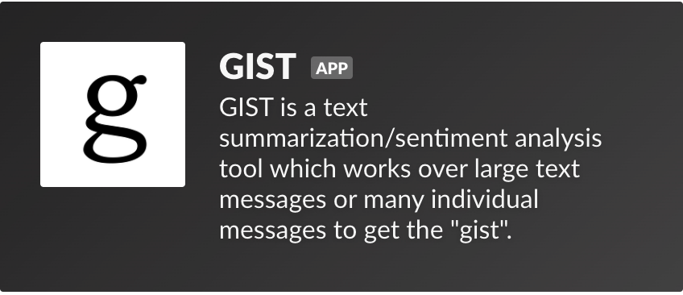
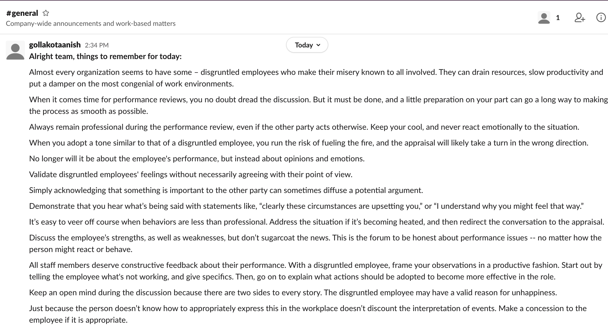
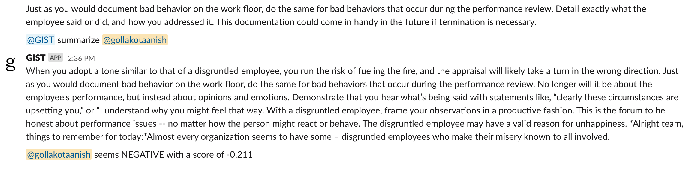
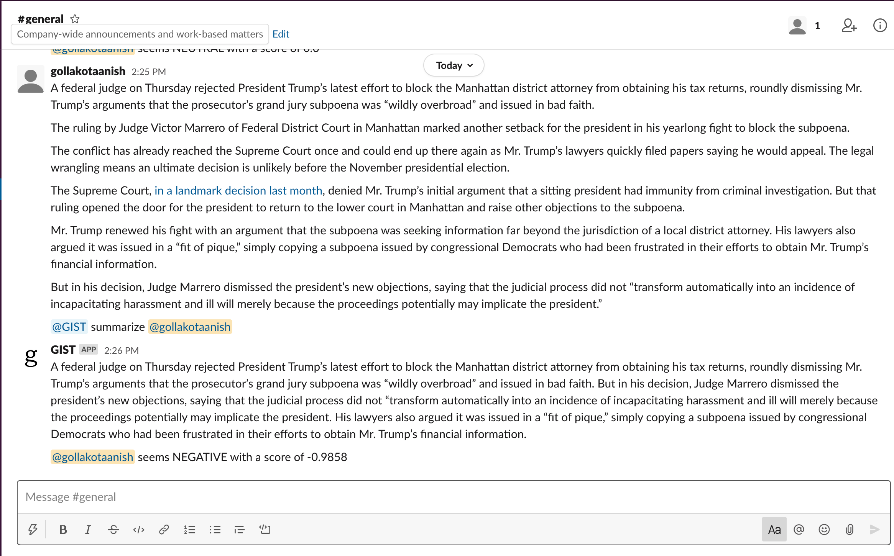

# GIST

GIST is an extractive text summarization and sentiment analysis tool making it easy for teams of people to get a "gist" or summary/analysis of what their co-workers are saying across their incredibly busy schedules.

## Note
In order to quickstart the use of this tool, an easy way is to use an NGROK pipeline to communicate between the script and Slack server.

## How it works
Simply add GIST to your workspace and get to use!

Whether it be over long messages of text that seem endless or a bunch of shorter messages, you can easily ask GIST to get a quick summary and sentiment expressed by the user

Simply call "@GIST summarize (username)" and get an analysis,

## Example: A Long List of Guidelines

A quick and easy way to get the **gist** of things over a long transcript of **individual** messages.

## Example: News Report

A short **gist** of the news displayed in your Slack portal from another application or member.

